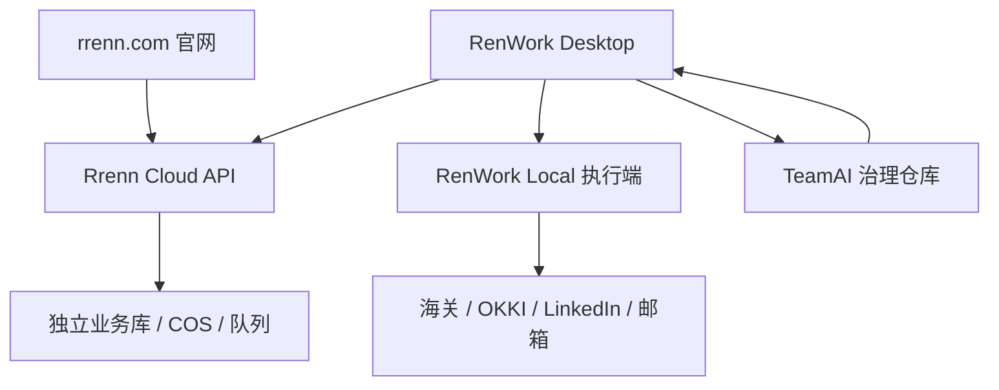

# 总体架构与仓库分工

## 1. 产品定义

### 1.1 rrenn.com

`rrenn.com` 是人人易品牌与 RenWork 产品的公开增长入口，负责：

- 解释企业级外贸增长操作系统的价值；
- 承载产品、解决方案、价格、案例、文章、文档和下载；
- 收集合规线索并转入销售流程；
- 提供 RenWork 稳定版本、更新说明和安装包镜像清单；
- 为搜索引擎与 AI 检索系统提供结构化、可引用、可验证的内容。

### 1.2 RenWork

RenWork 是本地优先的外贸 B2B AI 数字员工桌面端。目标闭环：

> 企业与产品理解 → 海关真实买家发现 → OKKI 联系人穿透 → LinkedIn 精准匹配 → 关系培育 → InMail/Email 开发 → 客户资产沉淀 → 团队知识进化

它负责用户登录态、可见浏览器、本地文件、人工审批、桌面任务和多模型协作。云端不是桌面端的替代品。

### 1.3 TeamAI 治理层

TeamAI 作为 Git 原生的团队治理与知识沉淀层，目标负责：

- `.teamai/skills/`：团队标准技能；
- `teamwiki/`：产品、行业、市场、案例、拒信和高转化经验；
- `.teamai/hooks/`：工具执行前后的安全与合规门禁；
- `.teamai/mcp/`：MCP 配置模板和能力清单；
- Recall：任务前召回知识；
- Learning PR：把人工纠偏沉淀成可审查的知识变更。

上述目录和命令是融合目标。Codex 实施前 MUST 检查 `cnproduct/teamai-cli` 和上游 `Tencent/teamai-cli` 的真实 README、版本和 CLI 帮助，不得凭本文虚构已实现命令。

## 2. 目标拓扑

关键边界：

- 浏览器自动化和账号登录态留在本地；云端不存 LinkedIn/OKKI 会话 Cookie。
- 官网数据库只保存官网线索、内容索引、同意记录、下载与版本数据，不与 RenWork 租户业务库混用。
- TeamAI 分发规则和知识，不直接持有生产密钥。
- Cloud API 承担跨设备、计费、长期监控、身份解析和经过授权的外部 API；Skill 不应隐藏成后端服务。

## 3. 仓库与部署对象

| 对象 | 建议位置 | 归属 | 发布位置 | 禁止事项 |
|---|---|---|---|---|
| 官网代码 | `cnproduct/rrenn-website`（PROPOSED） | 市场站点团队 | 腾讯云 Docker | 不复制 RenWork 页面源码 |
| RenWork | `cnproduct/renwork` | 产品/桌面端团队 | GitHub Releases | 不把 Electron 部署到网站服务器 |
| TeamAI 配置 | 独立私有治理仓库，或按 TeamAI 实际规范落位 | 销售运营/安全 | Git Pull/CI 分发 | 不提交生产凭证 |
| Cloud API | 官网仓库中的独立 service，后期可拆仓 | 平台团队 | 腾讯云 | 不与静态页面同进程保存本地账号状态 |
| 品牌契约 | V1 复制并记录版本/哈希；后期 `@rrenn/brand` | 品牌负责人 | npm/Git tag（后期） | 不做运行时跨仓库源码引用 |
| 版本清单 | Cloud API/COS 生成的签名 JSON | 发布工程 | `updates.rrenn.com` 或 API | 不让官网抓取未验证的任意 URL |

## 4. rrenn.com 与 RenWork 的具体分工

| 能力 | rrenn.com | RenWork Desktop | Cloud API | TeamAI |
|---|---|---|---|---|
| 品牌介绍/SEO | 主责 | 不负责 | 提供结构化内容接口 | 提供知识依据 |
| 产品诊断表单 | 收集与确认同意 | 可通过深链导入 | 校验、去重、保存、通知 | 不负责 |
| 企业/产品理解 | 展示示例 | 主交互与确认 | 可选解析服务 | 提供产品知识 |
| 海关买家发现 | 展示方法与案例 | 查询、证据、评分界面 | 数据连接、计费、长期任务 | 固化搜索方法 |
| OKKI 联系人穿透 | 仅解释能力 | 本地可见浏览器与导入清洗 | 不保存登录态 | 固化职位和筛选规则 |
| LinkedIn 匹配 | 仅解释能力 | 身份核验、任务建议、人工确认 | 可做公开实体解析 | 固化匹配和文案规则 |
| 邮件 | 线索确认邮件 | 草稿、审批、发送、回复 | 已授权 SMTP/Zoho 网关 | 合规模板与经验 |
| 社媒矩阵 | 内容营销 | 6 语种排期、审批、发布连接 | 授权发布和媒体存储 | 本地化策略 |
| 下载与更新 | 下载页 | 更新检查 | 签名清单、COS 镜像 | 不负责 |
| 计费/Credits | 套餐说明 | 余额、用量、购买入口 | 账本、幂等扣费、审计 | 不负责 |
| 团队治理 | 展示企业版 | 同步/冲突/学习候选 UI | 企业策略索引（可选） | 主责 |

## 5. Skill、MCP、Plugin、Cloud API 边界

### 5.1 Skills：方法与决策

适合做 Skill：企业/产品分析、HS Code 候选、海关搜索策略、买家评分、采购委员会判断、LinkedIn 身份核验、评论策略、邮件序列、本地化、合规检查说明、复盘与学习提炼。

Skill 的输出必须是可读步骤、结构化结果和工具调用计划；不得直接承担账号凭证存储、长期队列、跨租户数据、计费或无人值守高风险操作。

### 5.2 MCP：受控工具连接

适合做 MCP：海关数据查询、CRM 读写、Zoho/SMTP 草稿、邮箱验证、文件检索、已授权社媒发布、浏览器控制、企业内部知识检索。

MCP 必须有：明确输入/输出 schema、最小权限、超时、幂等策略、速率限制、审计字段、错误码和用户确认语义。

OKKI 第一阶段优先采用 RenWork Local Adapter；除非存在正式、可授权且条款允许的 API，不得把本地页面操作包装成“官方 OKKI MCP”。

### 5.3 Plugin：产品安装与能力包

RenWork 精准客户开发建议作为一个产品插件/能力包，组合多个 Skills、MCP 配置、界面入口和权限声明。Plugin 不承担核心业务数据存储，也不应把所有流程塞成一个超大 Skill。

### 5.4 Cloud API：持久化与平台能力

适合放云端：租户、计费、Credits、任务队列、公司实体解析、联系人去重、邮件验证、下载版本清单、长期信号监控、审计、Webhook 和通知。

云 API 不得承载：本地浏览器 Cookie、用户桌面文件明文、未经授权的批量社媒互动、不可解释的全自动外发。

## 6. 数据所有权与隔离

| 数据 | 存储位置 | 保留原则 | 加密/访问 |
|---|---|---|---|
| 官网文章/页面 | Git/MDX | 永久版本化 | 公开内容 |
| 官网线索 | `rrenn_web` 独立数据库 | 按隐私政策与业务周期 | 磁盘/备份加密，RBAC |
| 同意记录 | `rrenn_web` | 证明同意所需期限 | 不可静默覆盖 |
| RenWork 工作区 | 用户本地/经授权云同步 | 用户控制 | 本地 OS/应用加密 |
| OKKI/LinkedIn 会话 | 用户本地 | 最短 | 禁止上传云端 |
| 联系人/邮件 | RenWork 数据域 | 可配置 | 字段级权限与审计 |
| TeamAI 知识 | 企业 Git 仓库 | Git 历史 | PR 审批，敏感扫描 |
| 凭证 | OS Keychain/GitHub Secrets/云密钥服务 | 可轮换 | 永不进入 Git 或日志 |

## 7. 现状审计（AS-IS，2026-08-22）

公开访问观察：

- `http://rrenn.com` 返回 Nginx 承载的单页静态 HTML；
- `https://rrenn.com` 与 `https://www.rrenn.com` 未形成稳定一致的 HTTPS 入口；观察到根域与 `www` 可能指向不同基础设施；
- `robots.txt`、`sitemap.xml` 和一个设计系统路径均被同一首页 fallback 捕获；
- CTA 主要触发浏览器 `alert()`，没有真实线索闭环；
- 页面把 CSS 和内容集中在一个 HTML 中，使用外部 Google Fonts，不适合中国网络稳定性；
- 有硬编码价格和类似实时匹配数量的展示，发布前必须由内容负责人核实或改为明确的演示数据。

因此 P0 必须先做 DNS、证书、现有站点备份和内容事实核验，不允许直接覆盖。

## 8. 非功能目标

| 维度 | 官网目标 | RenWork 目标 |
|---|---|---|
| 可用性 | 月度 99.9% 起步 | 本地核心能力断网可用 |
| 性能 | 移动端 LCP ≤ 2.5s，CLS ≤ 0.1 | 常用交互即时反馈，长任务可取消 |
| 可访问性 | WCAG 2.2 AA | 键盘可达、焦点可见、对比度 AA |
| 安全 | OWASP 基线、CSP、速率限制 | 凭证进 Keychain、外部动作审批 |
| 可观测性 | 请求、错误、表单、发布、备份 | 任务状态、错误码、审计日志 |
| 可回滚 | 镜像 SHA + 前一版本 | GitHub Release/feature flag |
| 国际化 | `zh-CN` 首发，架构支持 `en` | 6 语种内容流程，UI 文案可国际化 |

## 9. 决策记录

### ADR-001：官网与桌面端分仓

结论：分仓。原因是发布周期、运行环境、权限和故障域完全不同。共享内容只通过契约，不用 Git submodule 或跨仓库相对引用。

### ADR-002：官网采用 Next.js 自托管

结论：建议 Next.js App Router + TypeScript + Tailwind，构建 `standalone` Docker 镜像。版本在初始化时锁定当时稳定版本，并提交 lockfile；本文不硬编码未来版本号。

### ADR-003：V1 不引入重量 CMS

结论：营销内容先使用 Git/MDX 和结构化数据文件；当非技术编辑频率、权限和审批需求明确后再引入 Headless CMS。

### ADR-004：本地优先的浏览器执行

结论：OKKI、LinkedIn 等需要用户账号或可见操作的流程留在 RenWork Local，默认人工确认。避免云端账号托管、平台条款风险和大面积封号故障域。

