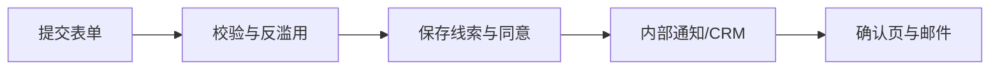

# rrenn.com 网站 PRD 与页面功能规范

## 1. 网站目标与受众

### 1.1 业务目标

1. 在 30 秒内说明 RenWork 是什么、为谁服务、解决什么问题。
2. 把“海关数据、OKKI、LinkedIn、邮件、社媒、TeamAI”解释成一条可理解的增长闭环。
3. 让访客完成四类主要动作：预约诊断、下载 RenWork、查看方案/案例、阅读文档。
4. 建立可信度：每个能力声明都有证据、边界、来源或示例，不使用虚假实时数字。
5. 支持 SEO 与 GEO：页面语义清晰、FAQ 可引用、实体和作者信息完整。

### 1.2 核心用户

| 用户 | 主要问题 | 首要 CTA |
|---|---|---|
| 外贸老板/总经理 | 获客不可控、团队经验难复制 | 预约增长诊断 |
| 外贸主管 | 客户池质量、流程和团队协同 | 查看企业方案 |
| 外贸业务员 | 找不到联系人、开发信低效 | 下载 RenWork |
| IT/数字化负责人 | 数据、安全、部署、集成 | 查看架构与安全 |
| 渠道/产业带伙伴 | 能否复制到行业与团队 | 联系合作 |

## 2. 信息架构

### 2.1 一级导航

| 导航 | 路径 | 二级页面 |
|---|---|---|
| 产品 | `/product` | Buyer Intent、Contacts、LinkedIn 360、Outreach、Social、Team Intelligence |
| 解决方案 | `/solutions` | 行业、团队角色、业务阶段 |
| 客户案例 | `/cases` | 列表、案例详情 |
| 定价 | `/pricing` | 套餐、Credits、FAQ |
| 资源 | `/resources` | Blog、Docs、Downloads、Training |
| 关于 | `/about` | 公司、联系、合作、法律 |

全站固定 CTA：`下载 RenWork`（次级）与 `预约 AI 增长诊断`（主按钮）。移动端导航展开后必须保留两项 CTA。

### 2.2 路由清单

```text
/
/product
/product/buyer-intent
/product/contact-intelligence
/product/linkedin-360
/product/outreach
/product/social-matrix
/product/team-intelligence
/solutions
/solutions/[industry]
/solutions/[role]
/pricing
/cases
/cases/[slug]
/downloads
/docs
/docs/[...slug]
/insights
/insights/[slug]
/training
/about
/contact
/diagnosis
/privacy
/terms
/cookies
/anti-spam
/open-source
/status
```

V1 必须完成：`/`、六个产品能力页面、`/solutions`、至少三个行业页、`/pricing`、`/downloads`、`/docs` 起始页、`/cases`、`/insights`、`/about`、`/contact`、`/diagnosis` 和全部法律页。

## 3. 首页 `/`

### 3.1 页面目标

用事实和工作流展示“人人易品牌 + RenWork 产品”，不把页面做成泛 AI 概念站。

### 3.2 模块顺序

| 模块 | 内容 | 交互/数据 | 验收 |
|---|---|---|---|
| 顶部公告 | 新版本、活动或正式通知 | 后台配置，可关闭 | 无公告时不占高度 |
| Header | 锁定版人人易 Logo、导航、下载/诊断 CTA | 桌面吸顶、移动抽屉 | 键盘可操作，焦点可见 |
| Hero | 一句话价值、两 CTA、真实产品界面 | 产品截图/短视频，非装饰性星空 | LCP 资源预加载；移动不溢出 |
| 增长闭环 | 7 步流程与每步结果 | 点击进入产品页 | 不自动横向滚动 |
| 痛点→结果 | 3–5 组可量化业务问题 | 仅使用经审批数字 | 数据有来源/口径 |
| 核心能力 | 海关、OKKI、LinkedIn、邮件、社媒、TeamAI | 卡片链接 | 标题直接说明用户价值 |
| 工作方式 | Local、Cloud、Skills/MCP/Plugin | 架构插图 | 不夸大自动化边界 |
| 行业方案 | 芯片、石材、卫生用品、婴童硅胶等 | 筛选/链接 | 行业页模板一致 |
| 案例 | 背景、方法、结果、证据 | CMS/MDX | 未获授权不展示客户 Logo |
| 安全合规 | 本地优先、审批、数据隔离 | 链接安全页 | 清晰写出人工确认边界 |
| 定价预览 | 套餐摘要 | 由单一价格配置生成 | 与价格页完全一致 |
| FAQ | 8–12 个真实问题 | FAQ schema | 可复制深链 |
| 最终 CTA | 诊断表单入口 | 带来源参数 | 不用 `alert()` 代替表单 |
| Footer | 产品、资源、公司、法律、备案 | 全站 | 链接检查通过 |

### 3.3 首页主文案骨架

- H1：`把真实买家，变成可持续推进的客户关系`
- 副标题：说明海关数据锁定公司、OKKI 找联系人、LinkedIn 建立信任、Email 推进转化、RenWork 编排全流程。
- 边界说明：`社媒互动和外发默认由业务员确认；RenWork 负责研究、建议、草稿、节奏和记录。`

文案可以优化，但不得把“建议/草稿/辅助”改写成未经授权的全自动群发或平台互动。

## 4. 产品总览 `/product`

展示三个层级：

1. 执行层：RenWork Desktop / Local；
2. 能力层：Skills、MCP、Plugin、Cloud API；
3. 治理层：TeamAI Skills、Wiki、Hooks、Recall、Learning PR。

必须提供：能力矩阵、端到端示例、部署方式、本地与云端边界、适用团队、常见集成、下载 CTA。

## 5. 六个产品能力页面

所有页面沿用统一模板：Hero → 问题 → 输入 → 工作流 → 输出证据 → 人工门禁 → 产品截图 → 集成 → FAQ → CTA。

### 5.1 Buyer Intent `/product/buyer-intent`

- 输入：官网、产品手册、HS Code 候选、目标市场、海关关键词。
- 功能：企业产品图谱、近 6 个月海关交易分析、买家实体归一、A+/A/B/C 分级、交易证据、供应商变化、采购趋势。
- 输出：买家公司列表、评分解释、证据来源、下一步建议。
- 必须显示：数据国家/更新时间/覆盖范围/证据链接/置信度；无数据时不能编造结论。

### 5.2 Contact Intelligence `/product/contact-intelligence`

- 核心定位：海关数据确定“联系哪家公司”，OKKI 与授权来源确定“联系谁”。
- 功能：采购委员会、职位关键词、联系人导入、去重、邮箱/电话状态、离职识别、数据来源。
- OKKI 描述必须区分本地 Adapter 与正式 API；没有已验证接口时不得写“官方 MCP”。
- 联系方式页面必须解释合法来源、用途限制、删除/纠错机制。

### 5.3 LinkedIn 360 `/product/linkedin-360`

- 公司匹配：公司名、域名、品牌、母子公司、地区。
- 人员匹配：姓名、职位、任职时间、地区和职责。
- 状态：Verified / Probable / Unverified / Outdated。
- 关系培育：公司/个人动态、建议点赞、专业评论、连接备注、InMail 草稿、下一步最佳行动。
- 必须写明：点赞、评论、连接、InMail 默认需要用户确认；不承诺规避平台限制。

### 5.4 Outreach `/product/outreach`

- 支持：Zoho、SMTP、企业邮箱和未来 CRM 连接器。
- 流程：研究 → 个性化 → 合规检查 → 草稿 → 审批 → 发送 → 退信/回复 → 跟进。
- 功能：序列、模板变量、时区、频率上限、退订、抑制名单、域名健康、回复归类。
- SMTP 使用 465/587；不得以直连 25 端口作为主方案。

### 5.5 Social Matrix `/product/social-matrix`

- 6 语种品牌档案、内容日历、平台适配、图文资产、审批、发布状态和复盘。
- “同一主题多语种”必须基于本地化规则，不是逐句直译。
- 未接入发布 API 的平台显示“导出/复制/人工发布”，不能伪装为已自动发布。

### 5.6 Team Intelligence `/product/team-intelligence`

- 展示 Skill 版本化、TeamWiki、任务前 Recall、Hooks、学习候选、PR 审批和冲突解决。
- 明确：知识变更需审查；阻力信号只是候选，不自动覆盖团队规则。
- 公开页面只解释能力，不暴露企业私有仓库、路径、客户数据或规则内容。

## 6. 解决方案页

### 6.1 `/solutions`

两个入口：按行业、按角色。提供流程成熟度自测和推荐组合，不以“所有企业都全自动”为默认假设。

### 6.2 行业模板 `/solutions/[industry]`

首批建议：`semiconductor`、`stone`、`hygiene`、`baby-silicone`、`gifts`、`pharma`。

每个行业页必须包含：

- 行业采购链与关键角色；
- 产品/HS Code/认证的示例，并标明“需企业确认”；
- 海关数据适用性与缺口；
- 联系人岗位词典；
- 市场差异和邮件切入点；
- 可验证的案例或匿名方法案例；
- 数据使用和合规边界。

不可把模型生成的 HS Code 或认证要求写成法律结论。

## 7. 定价 `/pricing`

### 7.1 内容模型

价格必须来自 `content/pricing.ts` 或后台单一数据源，首页只复用，不重复硬编码。

建议字段：套餐名、目标客户、交付周期、包含模块、用户数、Credits、支持级别、一次性/订阅、税费说明、可选服务、更新时间、审批人。

当前页面可能已有 19,800 / 29,800 / 59,800 / 128,000 / 380,000–800,000 等档位。这些只能作为待审批迁移内容；Codex MUST 在发布前要求产品/财务负责人确认，不得自行认定为正式价格。

### 7.2 功能

- 月付/年付仅在真实存在时提供切换；
- Credits 计算示例；
- 套餐对比表移动端可读；
- 企业方案询价；
- 价格版本和“最后更新”；
- FAQ：数据源费用、模型费用、账号费用、实施服务、退款和升级。

## 8. 案例 `/cases` 与详情

案例字段：客户类型、地区、行业、原始问题、数据范围、执行流程、人工投入、周期、结果口径、证据、授权状态、免责声明。

- 列表支持行业、地区、能力、团队规模筛选。
- 未获公开授权使用匿名名；客户 Logo、姓名和精确数据默认为不展示。
- 结果必须区分“线索数、有效联系人、回复、会议、询盘、成交”。
- 案例详情加入 `Article`/`CaseStudy` 可用的结构化数据，但不得伪造评分或评论。

## 9. 下载 `/downloads`

### 9.1 功能

- 自动识别 Windows/macOS/Linux，但允许手动选择；
- 展示稳定版版本号、发布日期、系统要求、文件大小、SHA-256、签名状态、更新日志；
- GitHub Releases 作为规范发布源；中国访问可使用腾讯 COS 镜像；
- 下载 URL 只能来自签名/受控 manifest，不接受查询参数拼接任意外部 URL；
- 旧版本和 beta 放在独立区域，清晰标注。

### 9.2 状态

`available`、`mirroring`、`deprecated`、`blocked`。若镜像失败，提供 GitHub 回退并显示状态，不返回损坏文件。

## 10. Docs、Insights、Training

### 10.1 Docs `/docs`

- 快速开始、安装、工作区、模型、Skills、MCP、企业/产品导入、海关、OKKI、LinkedIn、邮件、社媒、TeamAI、安全、故障排除。
- 文档版本与 RenWork release 对齐；旧版本保留明确提示。
- 代码块有复制、语言标签和安全占位符；任何凭证示例使用 `${SECRET_NAME}`。
- 支持全文搜索、目录、上一页/下一页、反馈“是否有帮助”。

### 10.2 Insights `/insights`

- 分类：市场情报、获客方法、产品更新、行业方案、合规、安全。
- 每篇有作者、审核人、发布日期、更新日期、引用、相关文章。
- AI 辅助内容必须人工复核事实，不批量生成低质量 SEO 页面。

### 10.3 Training `/training`

- 课程目录、适用角色、目标、章节、资料下载、报名/联系。
- V1 可为内容页；登录、付费和学习进度在真实需求确认后再做。

## 11. About、Contact、Diagnosis

### 11.1 About `/about`

公司定位、方法论、团队/顾问（经授权）、里程碑、开源说明、招聘/合作。不得用虚构团队头像、媒体背书或合作 Logo。

### 11.2 Contact `/contact`

按销售咨询、技术支持、渠道合作、隐私请求分类。展示服务时间和预计响应，不公开个人敏感联系方式。

### 11.3 Diagnosis `/diagnosis`

字段：

- 公司名、官网、联系人、职位；
- 工作邮箱；电话/WhatsApp 可选；
- 主营产品、目标市场、团队人数；
- 当前获客方式和主要痛点；
- 希望联系时间；
- 隐私同意和营销订阅分开勾选；
- `utm_source/medium/campaign/content/term`、referrer、landing path。

后端要求：Zod 校验、CSRF/同源策略、Captcha、IP/邮箱速率限制、幂等键、honeypot、审计 ID、成功页。前端只显示安全错误，不回显数据库或邮件栈信息。

处理流程：



CRM/Zoho 写入必须可重试且幂等；外部系统失败不能丢失官网主记录。

## 12. 法律与信任页面

必须有：隐私政策、服务条款、Cookie 政策、反垃圾邮件政策、开源许可/第三方声明。

- 按实际业务和律师意见填写，不由 Codex 独立给出法律结论；
- 记录政策版本和生效日期；
- 提供数据访问、更正、删除和退订入口；
- 中国大陆部署时根据主体与上线范围处理 ICP/公安备案、跨境数据和隐私要求。

## 13. SEO/GEO 技术要求

- `www.rrenn.com` 为 canonical；根域 301；禁止重复索引。
- 真实 `robots.txt` 和 `sitemap.xml`，不能被 SPA fallback 返回首页。
- 每页唯一 title/H1/meta description/canonical/Open Graph。
- 结构化数据：`Organization`、`SoftwareApplication`、`Product`、`FAQPage`、`Article`、`BreadcrumbList`；只标记页面真实可见内容。
- 语义化 HTML、面包屑、作者与更新时间、引用链接、术语解释和可直接回答的 FAQ。
- `llms.txt` MAY 提供产品与文档导航，但不能代替 sitemap/robots，也不得暴露私有知识。
- 多语言启用后使用真实翻译页面和 `hreflang`；V1 不生成空壳语言路径。

## 14. 内容模型建议

```text
content/
  pages/
  products/
  solutions/
  cases/
  insights/
  docs/
  pricing.ts
  faq.ts
public/
  brand/
  product-shots/
  industry/
```

MDX frontmatter 至少包含：`title`、`description`、`slug`、`status`、`owner`、`reviewer`、`publishedAt`、`updatedAt`、`locale`、`evidence`、`noindex`。

## 15. 网站全局验收

- 360、768、1024、1280、1440px 无横向溢出；
- Chrome、Edge、Safari 当前主版本可用；
- 键盘完成导航、打开菜单、提交表单；
- 主体文字和控件满足 WCAG AA；
- 404、500、离线、表单超时、接口限流有清晰恢复；
- Playwright 覆盖核心旅程，axe 无严重错误；
- Lighthouse CI 设定门槛：Performance ≥ 85，Accessibility/Best Practices/SEO ≥ 95（生产近似环境）；
- 内链、canonical、sitemap、robots、结构化数据自动检查；
- 所有 CTA 指向真实路由/表单/下载，不使用占位 `alert()`；
- 未审批的价格、统计、客户 Logo 和案例不得进入生产。

