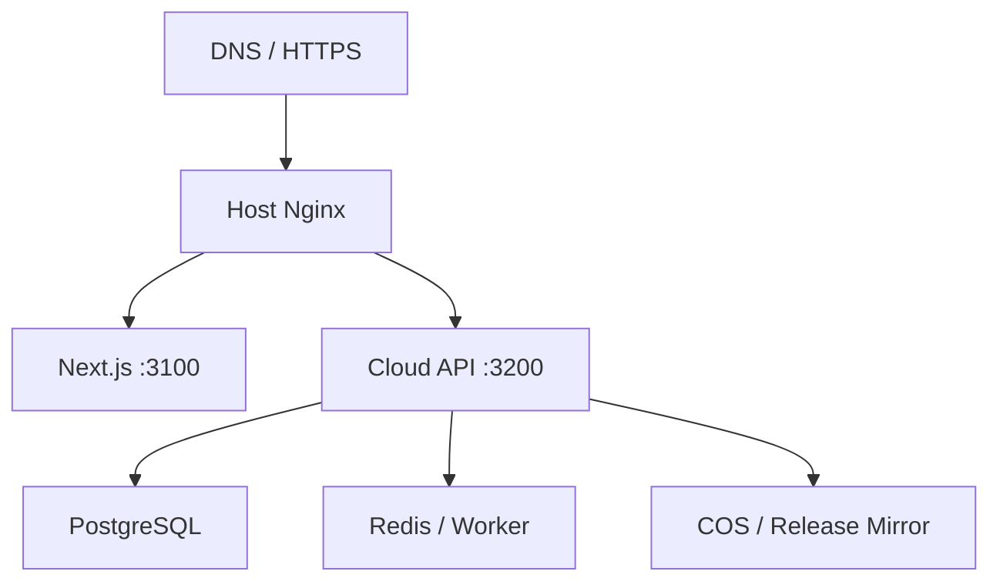

# 腾讯云部署与运维规范

## 1. 适用范围与已知参数

本规范用于把 `rrenn.com` 官网和轻量 Cloud API 部署到一台独立的腾讯云轻量应用服务器，不涉及把 Electron/OKKI/LinkedIn 本地执行环境搬到云端。

已知非秘密参数：

| 参数 | 值 |
|---|---|
| 公网 IP | `43.135.182.81` |
| SSH 端口 | `2222`（不得使用 22） |
| SSH 用户 | `ubuntu` |
| 网站隔离目录 | `/var/www/rrenn.com` |
| 主域名 | `www.rrenn.com` |
| 建议 canonical | `https://www.rrenn.com` |

用户曾在会话中暴露密码。该密码视为已泄露，MUST 在任何正式部署前轮换；本文和仓库只使用 SSH 私钥、GitHub Environment Secret 和云密钥服务。Codex 不得把密码复制到命令、workflow、`.env.example`、issue 或日志。

## 2. 容量建议

### 2.1 MVP 推荐

腾讯云轻量应用服务器：

- 4 vCPU；
- 8 GB RAM；
- 180 GB SSD；
- 12 Mbps 带宽；
- 月流量不少于 2 TB；
- Ubuntu LTS x86_64；
- 不需要 GPU。

可承担：Next.js 官网、轻量 API、PostgreSQL、低负载队列/Redis、Nginx、监控 agent 和每日备份。

### 2.2 升级阈值

升级到 4 vCPU/16 GB，或拆分数据库/worker，满足任一条件时评估：

- 持续内存 > 70%；
- 持续 CPU > 60% 或队列等待明显；
- 同机运行较重的文档索引、批量解析或多个 worker；
- PostgreSQL 工作集不能留在内存；
- 发布时构建和生产流量争抢资源。

生产服务器 SHOULD 只拉取已构建镜像，不在服务器上 `pnpm install`/构建，减少资源峰值和供应链面。

## 3. 地域选择

- 客户以中国大陆企业为主且主体可备案：优先广州/上海等大陆区域，完成 ICP 与适用备案。
- 需要快速上线、海外 API 连通优先：可选香港，但不得隐瞒大陆访问延迟、带宽与备案差异。
- 媒体、安装包和大文件放腾讯 COS + CDN，不用轻量主机磁盘充当下载分发源。

## 4. 服务器目录隔离

```text
/var/www/rrenn.com/
  compose.yaml
  .env                    # 600 权限，不进入 Git
  releases/
  shared/
    nginx/
    backups/
  data/
    postgres/
    redis/
  logs/
  scripts/
```

要求：

- 目录 owner 为专用部署用户或受限 `ubuntu`，Web 进程不使用 root；
- 文件权限最小化，`.env` 为 `0600`；
- 不改动 `/var/www` 下其他站点目录；
- Nginx 使用独立 server block，例如 `/etc/nginx/sites-available/rrenn.com`；
- 容器网络、volume、project name 使用 `rrenn_` 前缀，避免与同机站点冲突；
- 数据 volume 不挂到 Git checkout；发布镜像替换不影响数据。

## 5. 目标部署拓扑



端口策略：公网仅暴露 `2222/tcp`、`80/tcp`、`443/tcp`。3100/3200/Postgres/Redis 只监听 loopback 或 Docker 私网。

## 6. P0 上线前检查

Codex 先执行只读检查并保存结果到部署工单：

1. `dig +short rrenn.com A`、`dig +short www.rrenn.com A`、必要时 AAAA/CNAME；
2. `curl -I` 检查 HTTP/HTTPS、Server、重定向和证书；
3. `ss -lntup`、`docker ps`、`nginx -T`、磁盘/内存；
4. 识别当前 Nginx server block 和其它站点依赖；
5. 归档当前 `/var/www/rrenn.com`（如存在）、相关 Nginx 配置和证书路径；
6. 确认 Tencent DNS/Cloudflare/其他 DNS 的唯一权威区；
7. 记录回滚命令和当前站点快照位置。

现状观察表明根域 HTTP 与 `www` 可能走不同基础设施。MUST 先解决 DNS 分流，不能一边切换 A 记录一边覆盖服务器文件。

## 7. SSH 加固

执行顺序必须防止锁死：

1. 在本地生成独立的 Ed25519 部署密钥；
2. 将公钥加入远端 `authorized_keys`；
3. 新开终端通过端口 2222 验证密钥登录；
4. 保存主机指纹到受控 `known_hosts`；
5. 轮换已暴露密码；
6. 确认密钥与云控制台救援路径有效后，再禁用 SSH 密码登录；
7. 禁止 root 登录，配置 fail2ban 和连接速率限制。

GitHub Actions 使用独立只读/部署权限密钥，不复用管理员个人密钥。

## 8. Docker 与服务配置

### 8.1 官网镜像

Next.js 配置 `output: 'standalone'`；Docker 多阶段构建，运行阶段只包含 `.next/standalone`、`.next/static`、`public` 和运行时必需文件。容器使用非 root 用户，设置只读根文件系统（可行时）和 healthcheck。

### 8.2 Compose 要求

`compose.yaml` 至少定义：

- `web`：官网；
- `api`：线索、版本清单、健康接口；
- `postgres`：官网独立数据库；
- `redis`/`worker`：仅在确需异步任务时启用；
- 内部网络；
- 资源限制、重启策略、healthcheck；
- 明确镜像 SHA/tag，不使用生产 `latest`。

数据库密码、应用密钥、SMTP/CRM 凭证只从 `/var/www/rrenn.com/.env` 或云密钥服务读取。`.env.example` 只列变量名：

```dotenv
APP_ENV=production
APP_ORIGIN=https://www.rrenn.com
DATABASE_URL=${SECRET_DATABASE_URL}
REDIS_URL=${SECRET_REDIS_URL}
LEAD_ENCRYPTION_KEY=${SECRET_LEAD_ENCRYPTION_KEY}
TURNSTILE_SECRET_KEY=${SECRET_CAPTCHA_KEY}
ZOHO_CLIENT_SECRET=${SECRET_ZOHO_CLIENT_SECRET}
SMTP_PASSWORD=${SECRET_SMTP_PASSWORD}
COS_SECRET_KEY=${SECRET_COS_SECRET_KEY}
RELEASE_MANIFEST_PUBLIC_KEY=${PUBLIC_RELEASE_KEY}
```

示例不得填真实值。

## 9. Nginx 与 HTTPS

### 9.1 域名策略

- `www.rrenn.com`：canonical 生产站；
- `rrenn.com`：HTTP/HTTPS 永久 301 到 `https://www.rrenn.com$request_uri`；
- `api.rrenn.com`：MAY 独立 API 域名；V1 也可用 `/api` 同源；
- `updates.rrenn.com`：MAY 提供签名 manifest 与 COS 地址。

### 9.2 Nginx 要求

- 每个域名独立 server block；
- 只代理到 `127.0.0.1:3100/3200`；
- 保留 `Host`、`X-Forwarded-Proto`、真实 IP；
- 静态资源长缓存并带 immutable hash；HTML/manifest 使用短缓存；
- 表单 API 请求体上限、连接超时和限流单独配置；
- WebSocket/SSE 只在实际需要的路径启用；
- 设置 HSTS（证书与全站 HTTPS 稳定后）、CSP、X-Content-Type-Options、Referrer-Policy、Permissions-Policy；
- `robots.txt`、`sitemap.xml`、`favicon` 必须返回正确类型，不能被首页 fallback 捕获。

执行任何 reload 前 MUST `nginx -t`，失败不得覆盖现有有效配置。

### 9.3 证书

使用 Let’s Encrypt/Certbot 或腾讯云证书，覆盖根域与 `www`。先让 DNS 一致、HTTP 校验可达，再签发。设置自动续期与月度实际续期测试；告警阈值为证书剩余 30/14/7 天。

## 10. DNS 切换流程

1. 盘点权威 DNS 与当前记录；
2. 在切换前 24 小时将 TTL 调至 300；
3. 用 `staging.rrenn.com` 或本地 hosts 验证新站；
4. 备份旧站和 Nginx；
5. 更新 `www` 与根域到目标架构；
6. 从中国大陆和海外网络检查 A/AAAA、TLS、重定向、表单、下载；
7. 持续观察 60 分钟错误率；
8. 稳定 24–48 小时后恢复合理 TTL。

存在无法解释的 ELB/CNAME 时停止切换并确认记录所有者，不猜测删除。

## 11. GitHub Actions CI/CD

### 11.1 PR CI

每个 PR：

1. `pnpm install --frozen-lockfile`；
2. lint、format check、TypeScript；
3. unit tests；
4. Next production build；
5. Playwright 核心旅程；
6. axe、Lighthouse CI、链接、sitemap/structured data 检查；
7. secret scan、依赖漏洞检查、Docker image scan。

### 11.2 生产发布

- 只允许受保护 `main` 或签名 tag；
- 构建镜像并推送 GHCR，使用 commit SHA 和语义版本 tag；
- GitHub `production` Environment 需要人工审批；
- Secrets：`PROD_SSH_HOST`、`PROD_SSH_PORT=2222`、`PROD_SSH_USER`、`PROD_SSH_KEY`、`PROD_KNOWN_HOSTS`；
- 远端只拉取指定 digest，运行迁移（向后兼容），启动新容器，healthcheck 后切流；
- 部署失败自动恢复前一镜像；
- 第三方 Actions SHOULD 固定完整 commit SHA，workflow 默认 `contents: read`，按 job 最小化权限。

不得在 workflow 里出现服务器密码、`StrictHostKeyChecking=no`、无限制 `sudo`、`curl | sh` 或未固定 `latest`。

## 12. 数据库与迁移

- 官网数据库命名/用户与其他站点隔离，例如 `rrenn_web`；
- 迁移文件进入 Git，采用 expand/contract；
- 发布前自动备份，迁移需幂等或有明确版本锁；
- 线索表、同意表、外部同步状态、审计事件分表；
- PII 不进入分析日志；需要检索时存规范化 hash/受控索引；
- 生产数据不得复制到开发环境；如需复现使用脱敏 fixture。

## 13. 备份与恢复

| 对象 | 频率 | 保留 | 位置 | 恢复目标 |
|---|---|---|---|---|
| PostgreSQL 逻辑备份 | 每日 | 7 日/4 周/6 月 | 加密 COS | RPO 24h |
| 数据卷快照 | 每周 | 4–8 周 | 腾讯云快照 | 灾难恢复 |
| Nginx/compose/.env 密文备份 | 每次变更 | 最近 10 版 | 安全存储 | 30 分钟内恢复 |
| 官网内容 | 每次 Git 提交 | Git 历史 | GitHub | 即时回滚 |
| 镜像 | 每次发布 | 最近稳定版本 | GHCR | 15 分钟内回滚 |

每季度 MUST 做一次恢复演练。只有“备份成功”日志而没有恢复验证不算完成。

## 14. 日志、监控和告警

### 14.1 指标

- 主机：CPU、内存、磁盘、inode、网络；
- Nginx：请求率、4xx/5xx、延迟、上游错误；
- Web：Web Vitals、JS 错误、构建版本；
- API：成功率、P95、限流、重复提交；
- 业务：有效线索、Captcha 拒绝、CRM 同步、邮件通知；
- DB：连接数、慢查询、磁盘和备份；
- 发布：镜像 SHA、迁移、健康检查和回滚。

### 14.2 日志规范

JSON 结构化日志包含：timestamp、level、service、version、request_id、route、status、latency_ms、error_code。不得记录表单全文、邮箱正文、密码、token、Cookie 或 Authorization。

### 14.3 告警

- 5xx > 2% 持续 5 分钟；
- 健康检查失败 2 次；
- 磁盘 > 80%；
- 证书将过期；
- 备份失败；
- 表单异常激增、外部 CRM 连续失败；
- CSP/安全事件异常。

## 15. 安全基线

- 自动安全更新与月度维护窗口；
- UFW/腾讯云防火墙仅开放 2222、80、443；
- Docker socket 不暴露给 Web；
- 依赖 lockfile、SBOM、镜像扫描；
- 管理端独立域名、SSO/MFA、IP/身份访问控制；
- CSRF、防重放、Captcha、速率限制、CSP nonce；
- 退订和抑制名单优先于发送任务；
- 外部 Webhook 验签、时间窗、幂等键；
- COS 私有桶默认，下载使用受控公有对象或签名 URL；
- 定期轮换 SSH、数据库、SMTP、Zoho、COS 凭证。

## 16. 发布与回滚 Runbook

### 发布

1. PR 全绿、内容和安全审批；
2. 创建 release/tag，记录数据库迁移；
3. 构建和扫描镜像；
4. 生产环境审批；
5. 远端备份数据库；
6. 拉取 digest，执行兼容迁移；
7. 启动新服务并检查 `/health/live`、`/health/ready`；
8. 验证首页、表单、下载、robots、sitemap；
9. 记录发布版本。

### 回滚

1. 停止流量继续进入异常版本；
2. 回切上一个已知正常镜像 digest；
3. 数据库只执行事先设计的兼容回滚；禁止盲目 down migration；
4. 重新检查健康与核心旅程；
5. 保存日志和时间线，创建事故复盘。

## 17. 部署完成验收

- 端口 22 未作为部署路径，2222 密钥登录已验证；
- 已暴露密码已轮换，密码不在仓库/Actions；
- `/var/www/rrenn.com` 与其它站点完全隔离；
- `www` HTTPS 正常，根域只做 301；
- DNS 不再分裂到未知 ELB；
- 容器非 root、数据库不暴露公网；
- 生产镜像可追溯到 Git SHA，回滚演练通过；
- 备份、证书续期、监控和告警均有实际测试；
- 表单真实落库、通知失败可重试、重复提交不生成重复线索；
- 安装包从校验过的 Release manifest/COS 提供。

