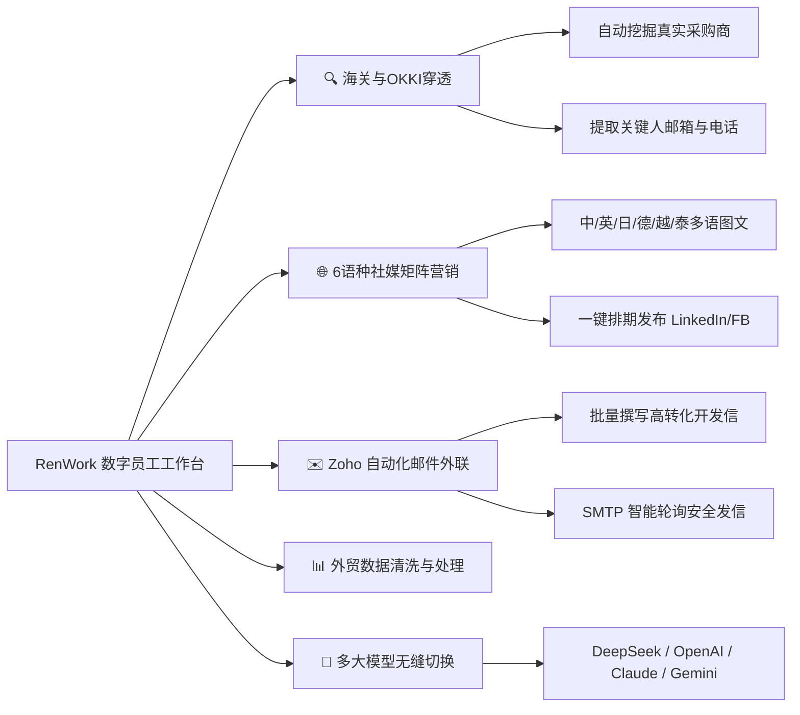

# RenWork · 人人易 AI 数字员工工作台 🚀

<div align="center">


### 新一代外贸 B2B 智能获客与出海营销数字员工操作系统
**人人易 AI（rrenn.com）出品 · 面向全球外贸企业的自动化 AI 数字员工桌面端**

[](LICENSE)
[](https://github.com/cnproduct/renwork/releases)
[](https://rrenn.com)

</div>

---

## 📖 简介 (About RenWork)

**RenWork** 是由**人人易 AI** 专为外贸出口、跨境出海企业打造的专业级 **AI 数字员工桌面工作台**。

区别于通用的大模型聊天工具，RenWork 深度集成了**外贸全链路自动化工具流**，让企业拥有全天候 7×24 小时自动挖掘买家、多语种社媒矩阵营销、个性化邮件外联的“超级数字员工”。

---

## ✨ 核心能力矩阵 (Core Superpowers)



### 1. 🔍 OKKI & 海关提单真实买家穿透
- 自动化对接与爬取 OKKI、提单数据库及海关进出口记录；
- 智能穿透采购商真实采购周期、主营品类与关键采购负责人（CEO / Procurement / Buyer）验证邮箱与电话。

### 2. 🌐 6 语种社媒矩阵全自动营销
- 覆盖 **英语、德语、日语、中文、越南语、泰语** 六大出海主流语言；
- 自动化生成高精信息图（Infographic）、痛点种草文案；
- 自动对接 LinkedIn 官方企业主页及 Facebook Page 进行定时、批量化排期营销发布。

### 3. ✉️ Zoho & SMTP 自动化精准外联
- 根据客户业务背景，由大模型深度分析并批量起草千人千面的高转化率外贸英文开发信；
- 自动同步至 Zoho Drafts 并通过多邮箱账户安全随机延时轮询发送。

### 4. 📊 外贸大数据清洗与报表处理
- 海量提单、展会名录、Excel / CSV 数据的自动化格式标准化、缺失值清洗、去重与智能打标签。

### 5. 🤖 多模型与 MCP 开放生态
- 支持 **DeepSeek V3 / R1、OpenAI GPT-4o、Claude 3.5 Sonnet、Google Gemini 2.5** 等顶级模型本地直连；
- 原生支持 **Model Context Protocol (MCP)** 协议，可无限扩展企业私有工具与本地知识库。

---

## 💻 客户端下载与安装 (Downloads)

| 操作系统 | 安装包格式 | 下载链接 | 架构支持 |
| :--- | :--- | :--- | :--- |
| **macOS** | `.dmg` | [下载 macOS 最新版](https://github.com/cnproduct/renwork/releases/latest) | Apple Silicon (M1/M2/M3/M4) / Intel |
| **Windows** | `.exe` | [下载 Windows 最新版](https://github.com/cnproduct/renwork/releases/latest) | x64 / ARM64 |
| **Linux** | `.AppImage` | [下载 Linux 最新版](https://github.com/cnproduct/renwork/releases/latest) | x64 / ARM64 |

---

## 🚀 快速开始与本地开发 (Developer Quickstart)

### 环境要求
- **Node.js**: `>= 20.0.0`
- **pnpm**: `>= 10.0.0`
- **Bun**: `>= 1.1.0`

### 本地拉取与构建

```bash
# 1. 克隆代码仓库
git clone https://github.com/cnproduct/renwork.git
cd renwork

# 2. 安装依赖
pnpm install

# 3. 启动桌面端开发模式
pnpm dev

# 4. 本地全量打包构建
pnpm build
pnpm --filter @openwork/desktop run build:electron
pnpm --dir apps/desktop exec electron-builder --config electron-builder.yml --mac dmg
```

---

## 🏢 关于人人易 AI

- **官方网站**：[https://rrenn.com](https://rrenn.com)
- **开源仓库**：[https://github.com/cnproduct/renwork](https://github.com/cnproduct/renwork)
- **技术支持**：support@rrenn.com

---

<div align="center">
  <sub>人人易 AI (rrenn.com) · 让外贸获客更简单，让中国制造连接全球</sub>
</div>
